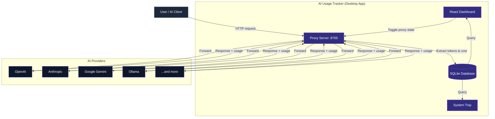
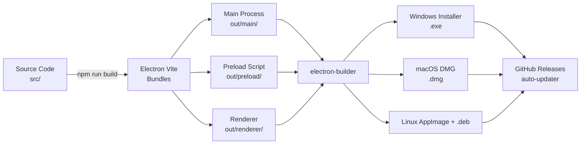

# AI Usage Tracker

Track token usage and costs across all major AI providers from a single desktop dashboard. AI Usage Tracker runs a lightweight local proxy that intercepts your AI API calls, extracts token usage, calculates costs in real time, and stores everything in a local SQLite database for fast querying.

� **v1.0.0** — Initial Release

---

## Table of Contents

- [Features](#features)
- [Architecture](#architecture)
- [Screenshots](#screenshots)
- [Supported Providers](#supported-providers)
- [How to Install](#how-to-install)
  - [Windows](#windows)
  - [macOS](#macos)
  - [Linux](#linux)
- [How to Run a Dev Build (Contributors & Testers)](#how-to-run-a-dev-build-contributors--testers)
- [Building Installers from Source](#building-installers-from-source)
- [Proxy Configuration](#proxy-configuration)
- [Build & Release Pipeline](#build--release-pipeline)
- [Security](#security)
- [Contributing](#contributing)
- [License](#license)

---

## Features

- **Local Proxy**: Intercepts API calls at `localhost:8765` — no need to change your code
- **Multi-Provider Support**: OpenAI, Anthropic, Ollama, GLM, MiniMax, Google Gemini, Mistral, Groq
- **Real-Time Dashboard**: Overview, provider drill-down, usage history, cost tracking
- **Cost Engine**: Per-model pricing with automatic cost calculation
- **System Tray**: Runs in the background, notifies on usage
- **Data Export**: CSV, JSON, and HTML reports
- **Auto-Updater**: Checks for new releases automatically (when published)
- **Security First**: API keys encrypted with system `safeStorage`; `nodeIntegration: false`; CSP headers

---

## Architecture



**Data flow in detail:**
1. Your AI client sends requests to `http://localhost:8765`
2. The proxy forwards the request to the real provider
3. The provider responds with tokens, usage, and cost data
4. The proxy extracts usage and writes it to a local SQLite database
5. The React dashboard reads from SQLite to show real-time metrics
6. The system tray shows today's totals in the background
7. All API keys are encrypted with `safeStorage` before being stored

---

## Screenshots

> **Note:** Placeholder sections below should be replaced with actual screenshots of the running app.

| Overview | Provider Drill-down | Settings |
|----------|---------------------|----------|
| [Screenshot: Overview] | [Screenshot: Provider Drill-down] | [Screenshot: Settings] |

---

## Supported Providers

| Provider | Type | Auth | Token Format |
|----------|------|------|-------------|
| OpenAI | Cloud | Bearer token | `usage.prompt_tokens / completion_tokens` |
| Anthropic | Cloud | x-api-key | `usage.input_tokens / output_tokens` |
| Ollama | Local / Cloud | None (local) or Bearer token (cloud) | Local: `prompt_eval_count`/`eval_count`; Cloud (`https://ollama.com/v1`): OpenAI-compatible `usage.*` |
| GLM (ZhipuAI) | Cloud | Bearer (JWT) | OpenAI-compatible |
| MiniMax | Cloud | Bearer token | OpenAI-compatible |
| Google Gemini | Cloud | URL param key | `usageMetadata.*TokenCount` |
| Mistral | Cloud | Bearer token | OpenAI-compatible |
| Groq | Cloud | Bearer token | OpenAI-compatible + cached tokens |

Custom providers can be added via the settings UI with configurable response format.

---

## How to Install

Download the latest release from the [Releases](../../releases) page.

| Platform | Download |
|----------|----------|
| Windows (64-bit) | `ai-usage-tracker-${VERSION}-setup.exe` |
| macOS (Universal) | `AI-Usage-Tracker-${VERSION}.dmg` |
| Linux (AppImage) | `ai-usage-tracker-${VERSION}.AppImage` |
| Linux (Debian) | `ai-usage-tracker_${VERSION}_amd64.deb` |

### Windows

1. Download `ai-usage-tracker-<VERSION>-setup.exe`
2. Run the installer and follow the setup wizard
3. Choose an installation directory (or accept the default)
4. Complete the installation
5. Launch from the **Desktop shortcut** or **Start Menu**
6. On first run, Windows Firewall may ask for permission for the proxy — allow it

### macOS

1. Download `AI-Usage-Tracker-<VERSION>.dmg`
2. Open the DMG file
3. Drag **AI Usage Tracker** into your **Applications** folder
4. Launch from Applications
5. If Gatekeeper blocks the app, right-click the app icon and select **Open**

### Linux (AppImage)

1. Download `ai-usage-tracker-<VERSION>.AppImage`
2. Make it executable:
   ```bash
   chmod +x ai-usage-tracker-<VERSION>.AppImage
   ```
3. Run it:
   ```bash
   ./ai-usage-tracker-<VERSION>.AppImage
   ```

### Linux (Debian)

1. Download `ai-usage-tracker_<VERSION>_amd64.deb`
2. Install with `dpkg`:
   ```bash
   sudo dpkg -i ai-usage-tracker_<VERSION>_amd64.deb
   # If dependency errors occur:
   sudo apt-get install -f
   ```
3. Launch from your applications menu or run:
   ```bash
   ai-usage-tracker
   ```

---

## How to Run a Dev Build (Contributors & Testers)

This section is for developers who want to run the app from source, contribute code, or test unreleased changes.

### Prerequisites

- **Node.js 20+** (see `.nvmrc` for the exact recommended version)
- **npm 10+**
- **Git**
- A C++ build tool (only needed if you need to rebuild `better-sqlite3` from source; see Troubleshooting below)

> **Tip:** If you use `nvm`, run `nvm use` from the project root to automatically switch to the correct Node version defined in `.nvmrc`.

### Step-by-Step Setup

```bash
# 1. Clone the repository
git clone https://github.com/TerraWatch/AI-Usage-Tracker.git
cd AI-Usage-Tracker

# 2. Switch to the pinned Node version (if using nvm)
nvm use

# 3. Install dependencies
npm install

# 4. Rebuild native modules for Electron
npm run postinstall

# 5. Start the development server
npm run dev
```

The Electron window should open automatically with hot reload enabled. Changes to renderer code will update live; changes to main-process code will restart the app.

### Available Development Scripts

```bash
# Start dev mode with hot reload
npm run dev

# Run the full test suite (includes native module rebuild)
npm test

# Run tests in watch mode
npm run test:watch

# Type-check all TypeScript (Node + Web)
npm run typecheck

# Lint the codebase
npm run lint

# Format code with Prettier
npm run format

# Preview the production build (no dev server)
npm run preview
```

### Building a Local Installer for Testing

```bash
# Build and package a Windows installer locally
npm run build:win

# Build and package a macOS DMG locally
npm run build:mac

# Build and package a Linux AppImage + .deb locally
npm run build:linux

# Build for all platforms at once
npm run build:all
```

Built artifacts are placed in the `dist/` directory. You can install them locally to test the end-user experience.

### Regenerating Icons

If you modify `resources/icon.png` or `resources/icon.svg`, regenerate the platform icons:

```bash
npm run generate-icons
```

This updates `resources/icon.ico` and `resources/icon.icns` from the source PNG.

### Troubleshooting

| Problem | Solution |
|---------|----------|
| `better-sqlite3` module not found / version mismatch | Run `npm run postinstall` to rebuild it for the correct Electron ABI, then run `npm test` again |
| Build fails with TypeScript errors | Run `npm run typecheck` to see which files have errors |
| `png2icons` not found when generating icons | Install with: `npm install png2icons --save-dev` |
| Windows: build fails with code signing errors | Code signing is optional for local builds; the installer will still be produced unsigned |
| macOS: `asarUnpack` warnings about `better-sqlite3` | This is expected; `electron-builder.yml` already configures `better-sqlite3` to be unpacked |

---

## Building Installers from Source

```bash
# Build for Windows (produces dist/ai-usage-tracker-<VERSION>-setup.exe)
npm run build:win

# Build for macOS (produces dist/AI-Usage-Tracker-<VERSION>.dmg)
npm run build:mac

# Build for Linux (produces dist/*.AppImage and dist/*.deb)
npm run build:linux

# Build for all platforms at once
npm run build:all

# Build and create a GitHub Release (requires GH_TOKEN)
npm run release
```

All build artifacts are output to the `dist/` directory.

---

## Proxy Configuration

To start tracking usage, route your AI client API requests through the local proxy:

**Proxy URL:** `http://localhost:8765`

Most AI SDKs and tools allow setting a custom base URL or proxy. Point the base URL to `http://localhost:8765` and the app will forward requests to the actual provider while extracting token usage from responses.

**Example:**
- **OpenAI Python SDK:** Set `base_url="http://localhost:8765"`
- **Anthropic SDK:** Set `base_url="http://localhost:8765"`
- **Environment variable:** `HTTPS_PROXY=http://localhost:8765`

> **Security Note:** API keys are stored using Electron's `safeStorage` (system keychain / credential manager) and are never written to plain text. The proxy only logs headers and token counts — never full request/response bodies.

---

## Build & Release Pipeline



**CI/CD:** Pushing a `v*` tag triggers `.github/workflows/build.yml`, which builds installers on Windows, macOS, and Linux runners in parallel, then publishes them as a GitHub Release.

---

## Security

- **API Key Encryption:** All provider API keys are encrypted with Electron `safeStorage` and decrypted only in the main process. The renderer never sees plaintext keys — only masked previews (e.g., `sk-pr...789`).
- **Isolation:** `nodeIntegration: false` and `contextIsolation: true` prevent renderer code from accessing Node.js APIs.
- **CSP:** Content Security Policy headers are enforced at both the `<meta>` tag level and via `session.defaultSession.webRequest.onHeadersReceived`.
- **Database Location:** The SQLite database lives in your user-data directory (`%APPDATA%` on Windows, `~/Library/Application Support` on macOS), not inside the app bundle.
- **No Hardcoded Secrets:** Grep verification confirms no API keys or credentials are embedded in the source.

---

## Contributing

Contributions are welcome! Please open an issue or pull request on GitHub. When contributing:

1. Fork the repository
2. Create a feature branch (`git checkout -b feature/my-feature`)
3. Commit your changes with clear messages
4. Push to your fork
5. Open a Pull Request

Before submitting:
- Run `npm run typecheck` — ensure zero errors
- Run `npm test` — ensure all tests pass
- Run `npm run lint` — ensure no lint errors

---

## License

Proprietary — All rights reserved.

---

> **Questions?** Open an issue on GitHub or check the [docs/](docs/) folder for implementation task summaries.

